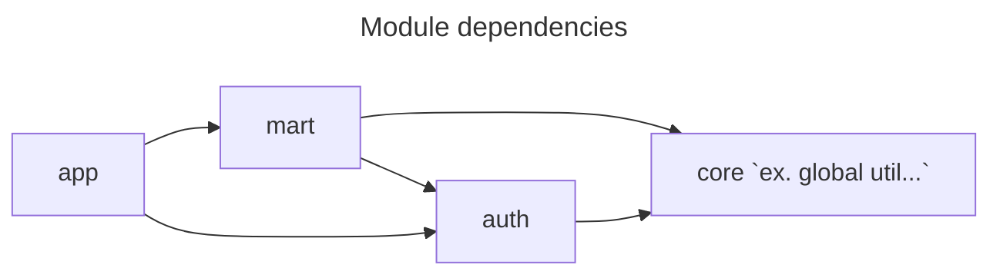

# Dependencies



# API Documentation

## Auth

### Login

Endpoint: `POST /login/token`

유저 정보를 갖고 인증을 진행합니다.

#### Request Body

```json
{
    "password": "string",
    "email": "string"
}
```

| Field    | Type   | Description |
|----------|--------|------------|
| password | string | 유저 비밀번호    |
| email    | string | 유저의 이메일    |

#### Response

```json
{
    "accessToken": "string"
}
```

| Field       | Type   | Description |
|-------------|--------|------------|
| accessToken | string | 인증된 토큰     |

## Cart

### 카트에 제품 추가 (Add Product to Cart)

새로운 제품을 카트에 추가합니다.

- URL: `POST /carts`
- 요청 형식: JSON
- 응답: 201 Created

**요청 예시**

```json
{
    "productId": 12345
}
```

| 필드      | 타입   | 설명                   |
|-----------|--------|-----------------------|
| productId | long   | 추가할 제품의 아이디.   |

**응답 예시**

```
HTTP/1.1 201 Created
```

#### 카트에 담긴 제품 목록 조회 (Find All Products in Cart)

카트에 담긴 모든 제품들의 목록을 조회합니다.

- URL: `GET /carts`
- 응답: 200 OK

**응답 예시**

```json
{
    "cartId": 1,
    "products": [
        {
            "id": 12345,
            "name": "상품명",
            "imageUrl": "https://example.com/product_image.jpg",
            "count": 2
        },
        {
            "id": 67890,
            "name": "다른 상품",
            "imageUrl": "https://example.com/another_product_image.jpg",
            "count": 1
        }
    ]
}
```

| 필드      | 타입   | 설명                      |
|-----------|--------|--------------------------|
| cartId    | long   | 카트 아이디.              |
| products  | 배열   | 카트에 담긴 제품들의 목록.|

#### 카트에 담긴 제품 수량 업데이트 (Update Product Count in Cart)

카트에 담긴 제품의 수량을 업데이트합니다.

- URL: `PATCH /carts`
- 요청 형식: JSON
- 응답: 200 OK

**요청 예시**

```json
{
    "productId": 12345,
    "count": 3
}
```

| 필드      | 타입   | 설명                   |
|-----------|--------|-----------------------|
| productId | long   | 업데이트할 제품의 아이디.   |
| count     | int    | 업데이트할 제품의 수량.   |

**응답 예시**

```
HTTP/1.1 200 OK
```

#### 카트에서 제품 삭제하기

카트에서 특정 제품을 삭제합니다.

- URL: `DELETE /carts`
- 파라미터: `product-id` (삭제할 제품의 아이디)
- 응답: 204 No Content

**요청 예시**

```
DELETE /carts?product-id=12345
```

**응답 예시**

```
HTTP/1.1 204 No Content
```

#### 예외 처리

다음 예외들에 대한 처리가 정의되어 있습니다.

- `AlreadyExistProductException`: 이미 카트에 존재하는 제품을 추가할 때 발생하는 예외.
- `DoesNotExistProductException`: 카트에 존재하지 않는 제품을 업데이트 또는 삭제할 때 발생하는 예외.
- `NegativeProductCountException`: 제품 수량이 음수인 경우 발생하는 예외.
